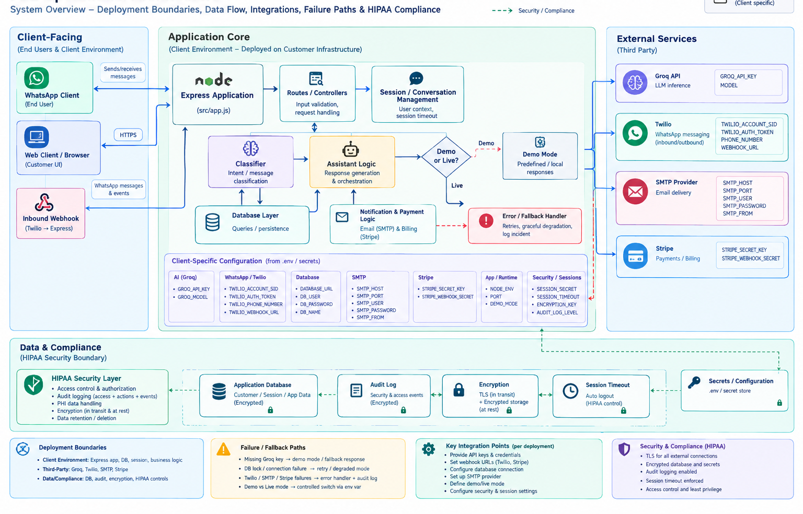
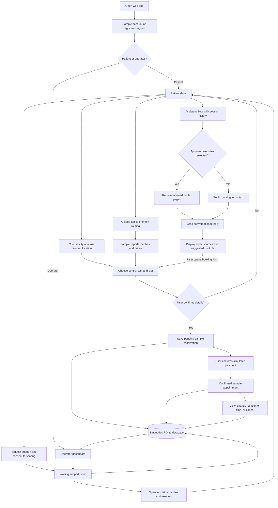

# DiagnoBot - Diagnostics Support Prototype

A browser-based prototype with a patient chat, a beta conversational assistant, sample appointment booking, and an operator dashboard. It demonstrates a diagnostics support workflow, not a production healthcare service.

**This implementation does not use Twilio or WhatsApp.** The folder name and older design documents reflect the original concept; users interact with this version through the web app.

> Use fictional details only. Reports, clinic listings, prices, slots and default payments are samples. No real clinic appointment is created, no money moves in demo payment mode, and no regulatory compliance certification is claimed.




## What Works In The Prototype

| Feature | What actually happens |
| --- | --- |
| Guided chat | Topic buttons use app handlers; other messages can use Groq to classify the request. |
| Assistant (Beta) | Groq generates conversational replies using short session history and public catalogue context. |
| Approved websites | The server retrieves configured public HTML pages and supplies excerpts with source links. This is not unrestricted web search. |
| Location | Browser permission enables approximate distance sorting of listed centres. Users can also select a city manually. |
| Reports and catalogue | Fictional report statuses and sample centre/test details are displayed. No real lab system is connected by default. |
| Appointments | Reservations, location/time changes and statuses are saved in the local database. Clinic inventory is simulated. |
| Payments | Default payment is an explicit simulation. Hosted Stripe Checkout is an optional integration requiring separate credentials. |
| Operator desk | Metrics reflect actual activity in this app. Operators can claim support requests, reply, resolve them and view appointment/payment statuses. |
| Support panel | Patients can collapse an active support request to a compact banner, expand it to read the full conversation and reply, or close it. Closing resolves the ticket on the server, not only in the browser; a resolved or hidden request will not reappear on its own. |
| Themes | Light/dark mode follows the system initially and remembers an explicit browser preference. |

## Required Setup

- **Node.js 24 LTS recommended**, with npm. The package minimum is Node.js 22.19.0.
- A modern browser, such as Edge, Chrome or Firefox.
- A **Groq API key** for text classification and beta conversation. Obtain one from the [Groq Console](https://console.groq.com/keys).
- Internet access for dependency installation, Groq calls and optional website retrieval.

No Twilio account, WhatsApp number, Docker, PostgreSQL installation, SMTP account, map API key or payment account is needed for the local demo. Embedded PostgreSQL (PGlite) and its schema are initialized automatically on first start.

Without a Groq key, the app still starts and the topic buttons, sample booking, payment simulation and operator workflows remain available. AI text requests show a controlled fallback.

## Quick Start

Run these commands in a terminal opened in the app folder, alongside [package.json](package.json). The examples use PowerShell.

For a fresh demo on Windows, macOS or Linux, use a supported Node.js version and a writable local folder. Copy or clone the source, including [package-lock.json](package-lock.json), but do not copy `node_modules`, `.data` or credentials from another machine. `npm ci` followed by `npm start` is enough to start the sample app; environment configuration is optional unless you need AI or external integrations. Each fresh installation creates its own database and encryption key.

### 1. Install Dependencies

```powershell
node --version
npm ci
```

`npm ci` installs the pinned dependency versions for the current machine. There is no frontend build step. Keep the dependency lockfile with the source; reinstall dependencies after moving to another operating system.

### 2. Configure The Environment (Optional For The Sample App)

Use [.env.example](.env.example) as the template. Keep an existing environment file and its key; do not overwrite it. For a new checkout only:

```powershell
if (-not (Test-Path .env)) { Copy-Item .env.example .env }
```

Set these values in your local `.env`. Enter your Groq key privately in the blank value:

```dotenv
NODE_ENV=development
PORT=3000
DATA_MODE=sample
GROQ_API_KEY=
GROQ_MODEL=openai/gpt-oss-20b
BETA_ASSISTANT=true
PAYMENT_MODE=demo
WEB_SOURCES=["https://www.nhs.uk/tests-and-treatments/blood-tests/"]
```

For this local setup, leave `DATABASE_URL`, `APP_ORIGIN`, `SMTP_URL`, `ENCRYPTION_KEY` and Stripe/LIS credentials empty. A local encryption key is generated automatically. Never commit credentials or put them in browser code.

`GROQ_MODEL` can select another model available to your account. Availability changes; use `npm run check:groq` to check classification with the configured model. It makes a real API request without displaying the key. AI usage is subject to provider quotas and pricing.

`WEB_SOURCES` accepts up to three operator-approved HTTPS HTML page URLs. Set it to `[]` to disable retrieval. The sample environment defaults to the NHS page above when the setting is absent.

### 3. Start The App

```powershell
npm start
```

Keep that terminal open. Normally the URLs are:

- Patient desk: **http://127.0.0.1:3000**
- Operator dashboard: **http://127.0.0.1:3000/bot-metrics-dashboard.html**

Use the URLs printed by the server: in local mode it can try the next port if the configured port is occupied. **Serve the HTML through the app; opening it directly from disk will not work.** Authentication, assets and data depend on the server.

For development with server auto-reload, run `npm run dev` instead. Press `Ctrl+C` in the server terminal to stop it. Restart after changing environment configuration. `npm start` starts the server; it does not make the prototype production-ready.

### Stopping The Server, Including One You Cannot Find

Only one process may hold the embedded database, so a forgotten server blocks a new `npm start` with `Embedded database is already open`, and blocks `npm run db:inspect` and other management commands.

- **Preferred:** press `Ctrl+C` in the terminal running the server and wait for the prompt to return. This releases the database cleanly.
- **If that terminal is lost or closed**, find and stop the process from any PowerShell window:

```powershell
# Show what is listening on the app port (adjust 3000 if you changed PORT).
Get-NetTCPConnection -LocalPort 3000 -State Listen | ForEach-Object { Get-Process -Id $_.OwningProcess }

# Stop it once you confirm it is this app's node process.
Get-NetTCPConnection -LocalPort 3000 -State Listen | ForEach-Object { Stop-Process -Id $_.OwningProcess }
```

On macOS or Linux, use `lsof -i :3000` to find the process, confirm it, then `kill <pid>`. Stop only this app's `node` process; do not stop unrelated processes. If a stopped preview used port 3001 or another `PORT`, check that port too.

After a forced stop, the database lock is reclaimed automatically; the next `npm start` may pause for about twelve seconds before serving. Your data is preserved either way.

### Optional: Separate Preview Data

Beta is a mode in the same app, not a separate installation. To use an isolated preview on port 3001, run from the app folder:

```powershell
$env:PORT = '3001'
$env:DATA_DIR = Join-Path $PWD '.data/beta-preview'
npm run dev
```

This creates or reuses a separate database, so it has different accounts, bookings and metrics. Only one process may open each embedded data directory. Use the matching port in the browser.

After stopping the preview, remove those terminal overrides to return to the settings in your environment file:

```powershell
Remove-Item Env:PORT, Env:DATA_DIR -ErrorAction SilentlyContinue
npm start
```

## How To Use It

### Patient Walkthrough

1. Open the patient URL and select **Demo patient**. No password is required for the built-in sample account. Alternatively, create an account using fictional details and sign in; sample mode skips email verification.
2. In **Guided**, select **Check reports**, **Find a centre** or **View prices** to see the sample data. Free-text requests use intent routing, not full conversational replies.
3. Switch to **Assistant** beside the Beta badge. Try: `Help me plan a sample lab visit in Chennai.` Then ask a follow-up. The assistant receives the last ten stored beta conversation entries, not permanent chat history.
4. Check **Approved websites** before sending a message to include configured page excerpts. Try: `According to the approved source, what are blood tests used for?` Retrieved sources appear as links. Retrieval failures are shown rather than treated as live information.
5. Select a city, or click the location icon and allow browser access. Location permission is optional; declining still allows manual selection. Coordinates remain in browser memory, and only the selected city is supplied with beta chat.
6. Open **Book appointment**. Choose city, centre, test, date and time, review the price, and confirm. This creates a **pending** sample reservation. Appointment times use India Standard Time; prices use INR.
7. In **My appointments**, select **Sample payment**, then **Simulate payment**. The booking becomes **confirmed**, with payment status **simulated**. No card or gateway account is needed and no money moves.
8. Use **Change location / time** to move the sample appointment, or **Cancel** to cancel it. The selected test and price remain unchanged during rescheduling.
9. Use **Request support**, then **Connect to support** to consent to sharing recent conversation context with an operator. Replies appear in the support panel, which opens as a compact banner. Use the expand control to read the conversation and reply, the collapse control to shrink it back to a banner, or the close control to end the request. Closing calls the server to resolve the ticket; it does not just hide the panel, and the panel stays hidden afterward rather than reappearing on the next status check.

The sun/moon button in the header switches themes. Sessions expire after 30 minutes without renewal; the app warns before expiry. Browser location requires HTTPS or a trusted localhost origin.

The sidebar navigation stays fixed in place while the conversation scrolls, and the message list is a fixed-height scrollable panel rather than one that grows the page — a long conversation stays contained and scrolls internally instead of pushing the composer and footer off-screen.

### Operator Walkthrough

1. Open the patient URL and select **Demo operator** to reach the dashboard.
2. Review request counts, active sessions, errors, response times, topics, appointment/payment statuses and recent audit events.
3. Claim a waiting support request before reading its conversation or replying. Send a reply, then resolve it when complete.

For a simultaneous patient/operator demonstration, use different browsers or a normal and private browser window. Ordinary tabs share login cookies. Opening the same demo role twice also replaces that role's previous session.

Both sides must use the same server URL and database to share tickets and activity. No external support team is automatically connected; the presenter operates the dashboard. Polling updates the dashboard but does not extend the session indefinitely.

## Prototype Flowchart

Adapted from the report, centre, pricing and support flows in [the original implementation framework](docs/WhatsApp_Bot_Implementation_Framework.md#appendix-b-bot-conversation-flow-examples). The historical WhatsApp/OTP entry is replaced by web sign-in, and the diagram includes the implemented beta and sample booking flow.



The model does not create reservations, charge cards or access patient report records itself. The user must use authenticated app controls to perform those actions. This diagram shows the default sample workflow, not a deployed clinical service.

## Data Storage And Inspection

By default, storage is local to the machine running the server:

| Run configuration | Database directory, relative to this folder |
| --- | --- |
| Normal start | `.data/postgres` |
| Separate preview above | `.data/beta-preview/postgres` |
| Custom `DATA_DIR` | The `postgres` subdirectory of that data directory |

These contain PostgreSQL internal files, not JSON documents or editable spreadsheets. PGlite does not expose a normal database port for pgAdmin or a VS Code PostgreSQL connection. Do not edit those files or delete the accompanying `local.key`; encrypted records depend on that key. Keep local data and keys private.

The dashboard displays operational data while the app runs. For a read-only table inspection, **stop the server using that database first**, then run from the app folder:

```powershell
# Normal database: counts and newest bookings.
npm run db:inspect
npm run db:inspect -- bookings

# Separate preview database.
npm run db:inspect -- --preview
npm run db:inspect -- --preview bookings
npm run db:inspect -- --preview audit_logs
```

Available tables are `users`, `sessions`, `bookings`, `audit_logs`, `tickets` and `ticket_messages`. A selected table returns at most 25 recent rows. Amounts are minor currency units: `20000` paise means INR 200. The inspector cannot edit data. Default inspection honors `DATA_DIR` and `DATABASE_URL`; `--preview` explicitly targets the local preview.

For `users`, the inspector decrypts and shows `name` from the encrypted profile, using the local `local.key` (or `ENCRYPTION_KEY`) for the data directory being inspected; `name` is `null` if no matching key is found or decryption fails. Email and password remain excluded and cannot be recovered by this or any command: `email_hash` and `password_hash` are one-way hashes (HMAC-SHA256 and bcrypt), and the original values were never stored anywhere. Message contents and other encrypted context fields also remain excluded.

Restart the app after inspection. Selecting a new data directory creates a separate dataset; it does not migrate existing records.

The embedded database uses an automatically renewed directory lock, not a process ID. Clean shutdown releases it. After a forced stop or crash, a lock with no heartbeat for ten seconds is reclaimed automatically; startup retries for about twelve seconds to allow this recovery. A live server continues renewing its lock and a second writer is refused, even on another HTTP port. Keep embedded data on a writable local disk and do not synchronize an open database between machines.

When intentionally moving existing sample data, stop the old server first and transfer the complete `postgres` directory together with its matching `local.key`, keeping them private. Omit the runtime `database.lock`; the destination creates a new lock. Do not mix keys from different installations or copy a running database.

## Optional Integrations

None of these are required for the showcase:

| Integration | Additional setup and limitations |
| --- | --- |
| Stripe test Checkout | Set `PAYMENT_MODE=stripe`, a Stripe test secret, webhook signing secret and matching `APP_ORIGIN`. Sample data accepts test keys only. Confirmation is verified server-side; a return URL alone is not proof of payment. |
| External PostgreSQL | Provision a server and set `DATABASE_URL`. Existing PGlite data is not migrated automatically. |
| Live lab reports/catalogue | Requires a real LIS API, trusted account-to-patient linkage and an approved catalogue. No live lab is configured by default. |
| Email verification/recovery | Live mode requires SMTP, origin and encryption configuration. Sample mode does not send recovery or verification emails. |

See [the beta operating guide](docs/BETA_ASSISTANT.md) for exact integration settings, webhook commands and limitations. Gateway behavior has automated tests with synthetic responses/events; testing an actual Stripe account requires your credentials. Do not enable live payments or use real patient data merely to demonstrate the prototype.

## Commands

| Command | Purpose |
| --- | --- |
| `npm start` | Start the web server. |
| `npm run dev` | Start with server file watching. |
| `npm run check:groq` | Make a small live classification request using the configured key/model. |
| `npm test` | Run Node.js tests for auth, storage, routing, beta, booking/payment and theme behavior. |
| `npm run lint` | Run ESLint on server and browser code. |
| `npm run db:inspect -- bookings` | Inspect selected database fields read-only after stopping the embedded server. |

Sample admin access is built in. For a separately registered, verified account, `npm run admin -- email@example.com` grants operator access. Stop the local server before running management commands that open its embedded database; sign in again afterward.

## Troubleshooting

| Symptom | What to check |
| --- | --- |
| Startup pauses after a crash | Allow about twelve seconds for automatic stale-lock recovery. There is no need to find or delete a PID-based lock on this version. |
| `Embedded database is already open` | Another server is still renewing the lock. Stop it with `Ctrl+C`, or find and stop it as shown in [Stopping The Server](#stopping-the-server-including-one-you-cannot-find), or use a separate `DATA_DIR`. A different HTTP port alone does not allow sharing an embedded database. Never manually remove an active lock. |
| `Legacy database lock found` | One-time upgrade case: older versions wrote a PID-only file. Stop every older server using that data directory, then remove only its `database.lock` file and restart. Legacy files cannot safely be reclaimed by age because old servers did not renew them. Do not delete `postgres` or `local.key`. New checkouts do not need this step. |
| Dependencies are missing on a new machine | Install supported Node.js with npm, then run `npm ci` from the app folder. Do not reuse another machine's `node_modules`. The default sample app needs no external database or credentials. |
| The page will not open | Start the app and use the exact printed URL. A previously stopped preview on port 3001 must be restarted. |
| Wrong or missing bookings | Check the port and `DATA_DIR`. Normal and isolated preview runs use different datasets. Terminal environment overrides take precedence over the environment file. |
| AI replies are unavailable | Check the Groq key privately, model availability, network and quota, then run `npm run check:groq`. This checks classification; also try a beta message. Topic buttons remain available during provider failure. |
| Node reports an unknown startup option | Use the required Node version. Start scripts enable system certificate authorities with `--use-system-ca`; do not disable TLS verification to work around certificate errors. |
| Website retrieval is unavailable | Ensure `WEB_SOURCES` is valid JSON with approved HTTPS HTML URLs. Redirects, private addresses, disallowed robots rules, large pages and timeouts can prevent retrieval. Arbitrary URLs entered in chat are not scraped. |
| Location is denied | Select a city manually. Geolocation needs permission and HTTPS or localhost. |
| Dashboard requires operator access | Sign in as Demo operator, using the same server URL as the patient. Use separate browser sessions to demonstrate both roles. |
| Reset/verification emails do not arrive | Email delivery is not enabled in sample mode. Use a demo account or another fictional sample account. |

## Code And Documentation

| Location | Responsibility |
| --- | --- |
| [bot-core.js](bot-core.js) | Server startup, selected port, storage lifecycle and shutdown. |
| [public/index.html](public/index.html) and [public](public) | Patient UI, beta/booking controls, themes and shared browser scripts. |
| [bot-metrics-dashboard.html](bot-metrics-dashboard.html) | Operator page, served by the app and backed by authenticated APIs. |
| [src/app.js](src/app.js) and [src/auth.js](src/auth.js) | HTTP setup, security middleware and account/session handling. |
| [src/features.js](src/features.js), [src/classifier.js](src/classifier.js), [src/assistant.js](src/assistant.js) | Guided routing, beta conversation and support APIs. |
| [src/web.js](src/web.js) and [src/bookings.js](src/bookings.js) | Approved-site extraction and reservation/payment state transitions. |
| [src/database.js](src/database.js), [src/schema.sql](src/schema.sql), [src/manage.js](src/manage.js) | Storage, actual table definitions and management/inspection commands. |
| [src/catalogue.json](src/catalogue.json) and [src/reports.js](src/reports.js) | Sample centre/pricing data and sample/live report handling. |
| [tests](tests) | Automated regression tests using the Node.js test runner. |
| [docs/BETA_ASSISTANT.md](docs/BETA_ASSISTANT.md) | Current detailed beta setup and operating guide. |
| [docs](docs) | Original requirements, SDD stages and historical WhatsApp concept. These are retained for context, not current setup instructions. |

## Prototype Boundaries

- Not a diagnostic, treatment or emergency service. The assistant is instructed to avoid clinical advice and result interpretation, but model output can still be inaccurate.
- No real LIS, clinic scheduling, staffing, appointment notification or support-team integration is enabled by default. Listed centres and availability are samples, not a search of all nearby clinics.
- Known identifiers are redacted before model calls; this is not complete medical-data de-identification. Do not submit real patient information during a showcase.
- Accounts and short-lived session/support content use application security controls, but this is not a security audit, compliance certification or production-readiness claim. Demo accounts intentionally bypass normal login and must not be exposed as real patient access.
- Paid Stripe cancellations, automatic refunds, chargeback handling and external refund synchronization are not implemented. Paid cancellations go through support.
- The documentation's historical deployment goals and compliance targets are not guarantees of this prototype.
